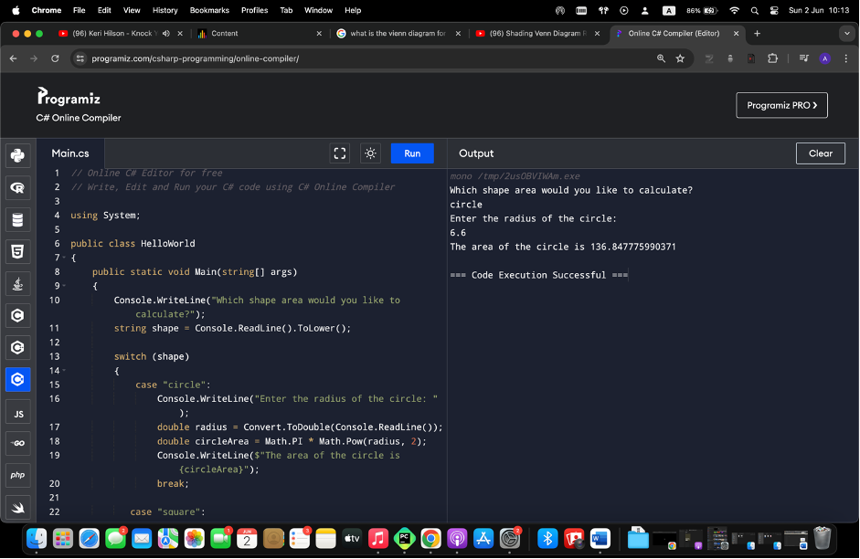

# Fundamentals of Programming Languages
## Area of Shape Calculator

### Overview
This program calculates the area of various shapes based on user input. It supports multiple shapes and performs the necessary calculations to provide the area of the selected shape.

### How It Works
1. **Shape Selection:** The program prompts the user to select a shape for which they want to calculate the area.
2. **Input Parameters:** Depending on the chosen shape, the program asks the user to input the required dimensions (e.g., radius for a circle, length and width for a rectangle).
3. **Area Calculation:** The program calculates the area using the appropriate formula based on the shape and the provided dimensions.
4. **Result Display:** Finally, the program displays the calculated area to the user.

### Sample Interaction

